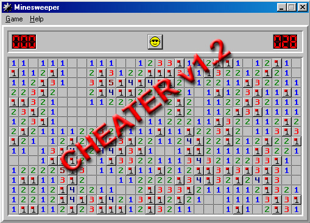



## Minesweeper Cheater AI \(was Minesweeper AI\) v1\.22

### Description

MINESWEEPER AI UPDATED! FASTER! MORE ACCURATE! Resolve Minesweeper in less than 30 sec! (only works with EXPERT level currently)

1: Run the Program...

2: Start Minesweeper...

3: Press the "S"

4: See the mouse fly all over the screen as it solves the GAME for you.

OR press "H" and it produces a HINT

(for those people using Windows NT/2000. win 9X minesweeper is included due to differences in colour) and lastly... DO NOT MOVE the MOUSE while the AI is running

and read the README file it is very helpful
 
### More Info
 

             |
---                |---
**Submitted On**   |2001-06-07 21:58:20
**By**             |[Liu Yucheng](https://github.com/Planet-Source-Code/PSCIndex/blob/master/ByAuthor/liu-yucheng.md)
**Level**          |Intermediate
**User Rating**    |4.5 (18 globes from 4 users)
**Compatibility**  |VB 4\.0 \(32\-bit\), VB 5\.0, VB 6\.0
**Category**       |[Complete Applications](https://github.com/Planet-Source-Code/PSCIndex/blob/master/ByCategory/complete-applications__1-27.md)
**World**          |[Visual Basic](https://github.com/Planet-Source-Code/PSCIndex/blob/master/ByWorld/visual-basic.md)
**Archive File**   |[Minesweepe20816682001\.zip](https://github.com/Planet-Source-Code/liu-yucheng-minesweeper-cheater-ai-was-minesweeper-ai-v1-22__1-23888/archive/master.zip)

